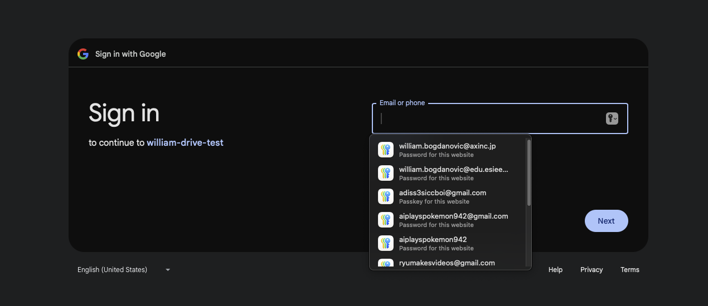
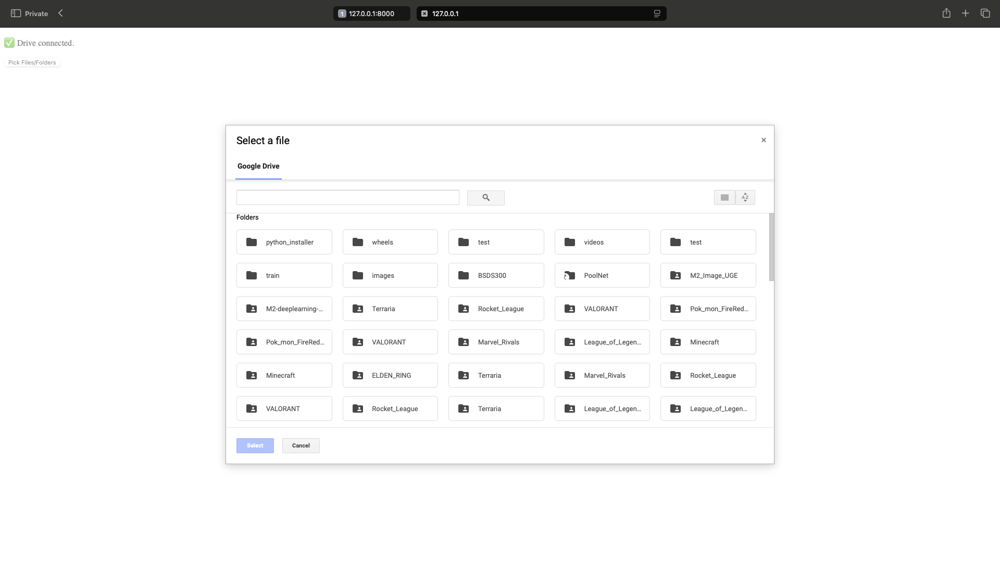
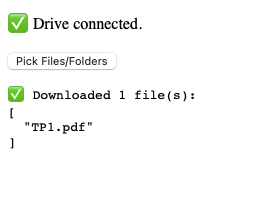

## Retrieval: Subcomponents

### 1. **Google Picker (Frontend)**

* Embedded directly in the web interface
* Handles Google OAuth via built-in Picker mechanisms
* Allows users to select specific files or folders from their Drive
* File types can be restricted (currently: images, PDFs, Google Docs, and folders)
* MIME type filtering is configurable in `webpage/webpage/settings.py`
* The UI cannot do anything more than simply return teh metadata of the selected items. It cannot see the sub-items and fodlers of a selected folder. We rely on the next part for this.

IDEA : have a simple interface where we can show per account, the selected files, and when the user selects new files, they get added to this interface/lsit, and the user can remove these selected files. this idea exists because the current google UI picker is not suited for multiple folders, and files within different folders, it can only select what is visible at the same time on the Picker.

### 2. **Google Drive REST API (Backend)**

* Receives the selected items as JSON from the Picker
* It can access given IDs and traverse them, it can return sub-files from a fodler ID.
* For folders: traverses recursively to collect all underlying files
* For files: verifies access and downloads each file temporarily
* Downloads are stored in a `downloads/` subdirectory and may be discarded after embedding

## Search:

### 1. **Search Scopes**

* Can search on just selected files/folders
* Can search on user Drive
* Can search on Shared Drives (not full entreprise-wide, user needs to have access)

### 2. **Search targets**

* Can search file/folder names
* Can search file contents (includes metadata?)
* Can filter file types

### 3. **Notes**

* Can run different searches for both text RAG and vision RAG
* Can be used for keywords, but highly unreliable due to lack of info on 'full text' search
* Free, with quotas

check this [link](https://developers.google.com/workspace/drive/api/guides/search-files#python) for all search queries.

### 4. **Other solutions?**

* Cloud Search is limited to Google Workspaces, which means that the user needs to have a workspace, not always true, it's a paid service.

* build our own text extraction (OCR + pdf text extraction) and store text versions of indexed files, for fast and much better keyword search (still separate from the actual RAG, this is just for retrieval) (overkill?)
