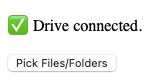

## Retrieval: Subcomponents

### 1. **Google Picker (Frontend)**

* Embedded directly in the web interface
* Handles Google OAuth via built-in Picker mechanisms
* Allows users to select specific files or folders from their Drive
* File types can be restricted (currently: images, PDFs, Google Docs, and folders)
* MIME type filtering is configurable in `webpage/webpage/settings.py`
* The UI cannot do anything more than simply return teh metadata of the selected items. It cannot see the sub-items and fodlers of a selected folder. We rely on the next part for this.

### 2. **Google Drive REST API (Backend)**

* Receives the selected items as JSON from the Picker
* It can access given IDs and traverse them, it can return sub-files from a fodler ID.
* For folders: traverses recursively to collect all underlying files
* For files: verifies access and downloads each file temporarily
* Downloads are stored in a `downloads/` subdirectory and may be discarded after embedding

## Search: Subcomponents